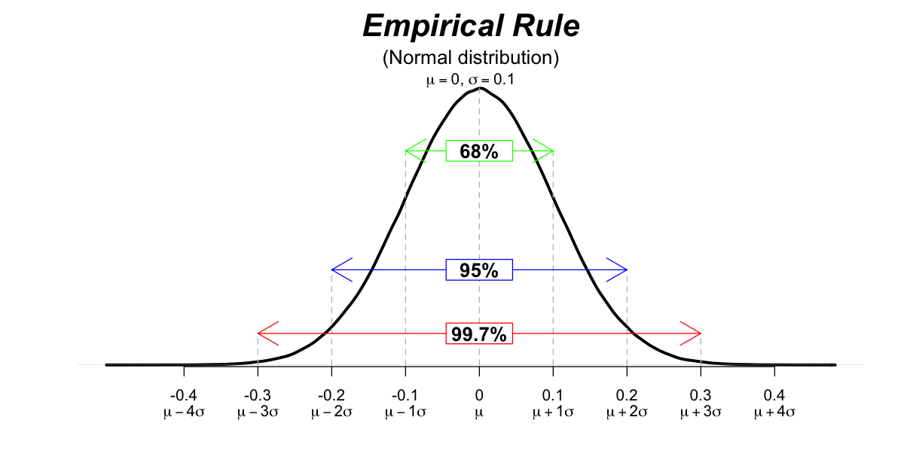
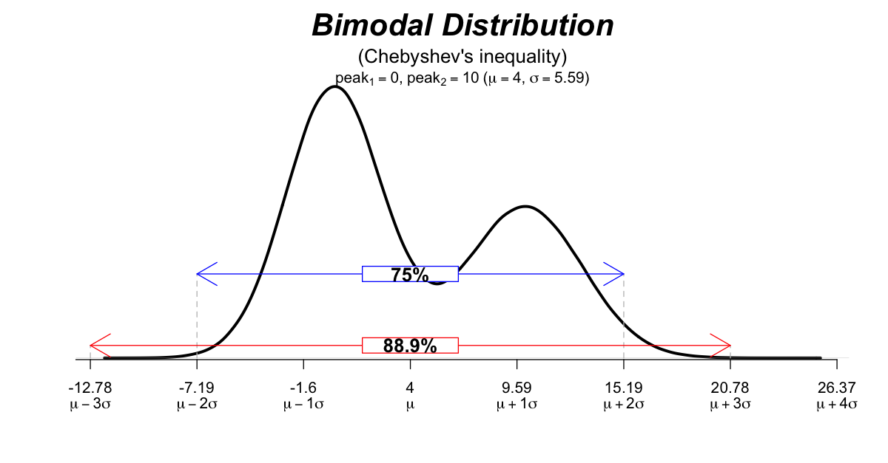

# Plot common statistical distributions
### This repo contains code to generate common statistical distributions for educational purposes

|Distribution| R & Python   Scripts                                                                                       |image|
|---|---------------------------------------------------------------------------------------------------------------|---|
|Normal Distribution| [normal_distribution.R](R/normal_distribution.R)   [normal_distribution.py](Python/normal_distribution.py) ||
|Bimodal Distribution| [bimodal_distribution.R](R/bimodal_distribution.R)   [bimodal_distribution.py](Python/bimodal_distribution.py) ||
