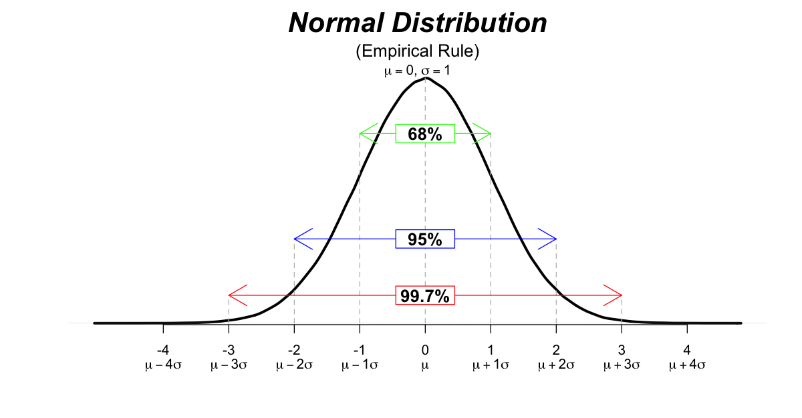

# Plot common statistical distributions
### This repo contains code to generate common statistical distributions for educational purposes

|Distribution|R|Python|image|
|---|---|---|---|
|Normal Distribution|[normal_distribution.R](R/normal_distribution.R)|||
